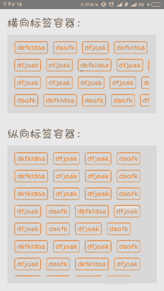

# TagLayouter
自定义控件，用于进行标签（TextView及其子类）的排版，支持纵向与横向排版

# 效果图


## 添加引用库
* Android Studio
	使用前，对于Android Studio的用户，可以选择添加:
	```
	compile 'com.gunter:tag-layouter:1.0.0'
	```
	
* Eclipse
	下载最新arr包：[tag-layouter-1_0_0.arr](tag-layouter-1_0_0.aar?raw=true)

## 相关属性
* dist_horizontal - 设置标签之间的横向间距
* dist_vertical - 设置标签之间的纵向间距
* orientation - 标签横向排版（horizontal）或者纵向排版（vertical）
* row - 设置固定行数（仅当orientation="horizontal"有效）

## 用法
* 横向布局标签（外层需要套一个HorizontalScrollView）
```xml
<HorizontalScrollView
        android:layout_width="wrap_content"
        android:layout_height="wrap_content"
        android:padding="16dp">

        <com.coding.tag_layouter.AutoLayoutContainer
            android:id="@+id/alc_horizontal"
            android:layout_width="wrap_content"
            android:layout_height="wrap_content"
            app:dist_horizontal="12dp"
            app:dist_vertical="12dp"
            app:orientation="horizontal"
            app:row="4" />

</HorizontalScrollView>
```

* 纵向布局标签（外层需要套一个ScrollView）
```xml
<ScrollView
        android:layout_width="wrap_content"
        android:layout_height="wrap_content"
        android:padding="16dp">

        <com.coding.tag_layouter.AutoLayoutContainer
            android:id="@+id/alc_vertical"
            android:layout_width="wrap_content"
            android:layout_height="wrap_content"
            app:dist_horizontal="12dp"
            app:dist_vertical="12dp"
            app:orientation="vertical" />

</ScrollView>
```

* 添加Tag（TextView及其子类）
```java
autoLayoutContainer.addTag(R.layout.tag, String... tags);
```
    其中tag.xml如下：
```xml
<TextView xmlns:android="http://schemas.android.com/apk/res/android"
    android:layout_width="wrap_content"
    android:layout_height="wrap_content"
    android:background="@drawable/selector_shape_tag"
    android:textColor="@color/selector_text_color_tag"/>
```

* 设置标签点击监听
```java
autoLayoutContainer.setOnSelectListener(new AutoLayoutContainer.OnSelectListener() {
    @Override
    public void onSelect(View tag, int position) {
        //todo 处理触发点击事件的tag
    }
});
```
